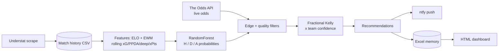

# La Liga match prediction & value-betting pipeline

[](https://github.com/martifebrer/apostes-laliga/actions/workflows/tests.yml)

An end-to-end machine-learning project: it scrapes advanced football statistics, trains a
probabilistic model that predicts **Home / Draw / Away** for La Liga matches, compares those
probabilities with live bookmaker odds to detect *value*, sizes stakes with fractional Kelly,
and runs the whole thing as a weekly interactive workflow with phone notifications and a
tracking dashboard.

> Documentation in Catalan lives in [`docs/LLEGEIX_ME.ca.txt`](docs/LLEGEIX_ME.ca.txt); code
> comments are mostly in Catalan too.

## Highlights

- **Leakage-free evaluation** – walk-forward backtest over 5 seasons (7-season rolling training
  window, a fresh model per fold, features computed once chronologically).
- **Feature engineering from scratch** – ELO ratings plus exponentially-weighted rolling
  xG / PPDA / deep completions / xPts (home-only, away-only and global, with a short *and*
  a long form window → 59 features), built on Understat data.
- **Probability quality, not just accuracy** – evaluated with log loss and Ranked Probability
  Score, since betting needs calibrated probabilities.
- **Bet sizing** – quarter-Kelly capped at 20 % of the bankroll, plus a per-team confidence
  multiplier updated from realised-vs-expected returns.
- **Production-style automation** – interactive CLI that scrapes new results, asks which
  recommended bets were actually placed, settles them (bankroll + confidence), pulls live odds
  for a chosen matchday, recommends bets and pushes them to the phone via [ntfy](https://ntfy.sh).
- **Robustness details** – per-match bookmaker fallback, sanity filter against the market
  average (catches stale odds), official fixture calendar used to map matches to matchdays,
  secrets kept out of the code (`.env`).

## Model results (out of sample)

Walk-forward backtest, trained on the previous 7 La Liga seasons + Premier League, Serie A,
Bundesliga and Ligue 1:

| Test season | Matches | Accuracy | Log loss | RPS    |
|-------------|--------:|---------:|---------:|-------:|
| 2021-22     | 380     | 50.8 %   | 1.0032   | 0.1979 |
| 2022-23     | 380     | 55.0 %   | 0.9776   | 0.2021 |
| 2023-24     | 380     | 53.4 %   | 0.9582   | 0.1846 |
| 2024-25     | 380     | 55.5 %   | 0.9640   | 0.1930 |
| 2025-26     | 378     | 52.1 %   | 0.9781   | 0.2002 |
| **Total**   | **1898**| **53.4 %** | **0.9762** | **0.1955** |

For context, always predicting the home side gets ≈ 46 % on these same seasons; the log loss of a
uniform guess is 1.0986.

### An honest note on the betting strategy

The "Value Local" / "Contrarian Visitant" rules and their thresholds were tuned by grid search
on **a single season (2025-26)**, so any backtest ROI from that tuning is in-sample and
very likely overstated. Betting markets are efficient; this repository is a modelling and
engineering exercise, **not** financial or betting advice, and profitability is not claimed.
Live results are tracked in the pipeline's own spreadsheet/HTML report.

## How it works



Weekly flow (`python automatitzacio/actualitza_jornada.py`):

1. Scrape newly played matches from Understat into the history.
2. Ask which of last week's recommended bets were really placed; settle those (result,
   bankroll, team confidence) and drop the rest so they never count.
3. Choose a matchday and fetch its odds (matchday → fixtures via the official calendar).
4. Predict, filter, size and recommend; print to console and push to the phone.

## Repository layout

| Folder | Purpose |
|--------|---------|
| `automatitzacio/` | Weekly live workflow (scraping, memory, recommendation, notifications, dashboard) |
| `entrenament_model/` | Feature engineering, model definition, walk-forward training |
| `simulacio/` | Strategy backtests, staking, bootstrap/grid-search validation |
| `rf_optimization/` | Hyper-parameter and decay search for the model |
| `data/` | Small reference data (official calendars, historical odds) |
| `tests/` | Unit tests (`pytest`) |

## Running it

```bash
pip install -r requirements.txt
cp .env.example .env        # add your The Odds API key (and optionally an ntfy topic)
pytest -q tests
```

Trained models and the scraped match history are **not** versioned (size, scraping terms), so
the full pipeline needs them generated locally first; `automatitzacio/inicialitza_memoria.py`
seeds the tracking spreadsheet and `entrenament_model/entrenament.py` retrains the models.

## Stack

Python · pandas · NumPy · scikit-learn · matplotlib · requests · understatapi · openpyxl ·
The Odds API · ntfy · pytest · GitHub Actions

## License

MIT – see [`LICENSE`](LICENSE).
